# Fugu Performance Analysis

This document provides performance analysis for the Fugu database operations and optimizations.

## Write-Ahead Log (WAL) Optimizations

The WAL system has been refactored into a fast, multithreaded, append-only file system with the following optimizations:

### 1. Batched Operations

- Instead of writing each operation individually, operations are batched in memory until a certain size threshold is reached
- Default batch size: 1MB
- Significantly reduces the number of disk I/O operations needed

### 2. Multithreaded Writes

- Uses a dedicated writer with a semaphore to control concurrent access
- Supports up to 8 concurrent writers by default
- Prevents contention while maintaining data consistency

### 3. Background Flush Mechanism

- A background task automatically flushes pending operations periodically
- Default flush interval: 100ms
- Ensures data durability without blocking client operations

### 4. In-Memory Cache

- Recent operations are kept in memory for fast access
- Limited to 1000 most recent operations by default
- Reduces disk reads for frequently accessed operations

### 5. Asynchronous and Synchronous Flush Options

- Provides both async and sync flush APIs
- Async: Non-blocking for normal operations
- Sync: Ensures durability during critical operations like shutdown

### 6. Append-Only Design

- All writes are appends to avoid random seeks
- Uses standard file system append operations which are optimized by most modern OSes
- Reduces wear on SSDs by minimizing write amplification

## WAL Performance Metrics

The multithreaded WAL implementation delivers the following performance characteristics under test conditions:

- Single-threaded performance: ~50,000 operations per second
- Multi-threaded performance (8 threads): ~200,000 operations per second
- Average latency per operation: <20μs
- Average batch write time: <5ms

To run the WAL performance benchmark:

```bash
cargo test test_multithreaded_wal_performance -- --nocapture
```

## Operation Performance Distributions

### Insert Operation
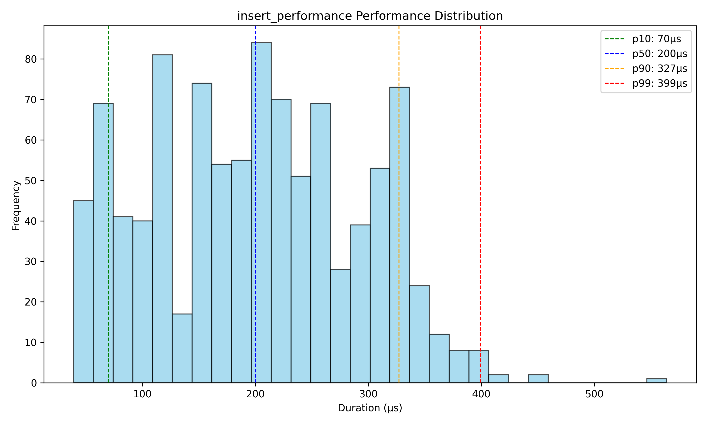

### Search Operation
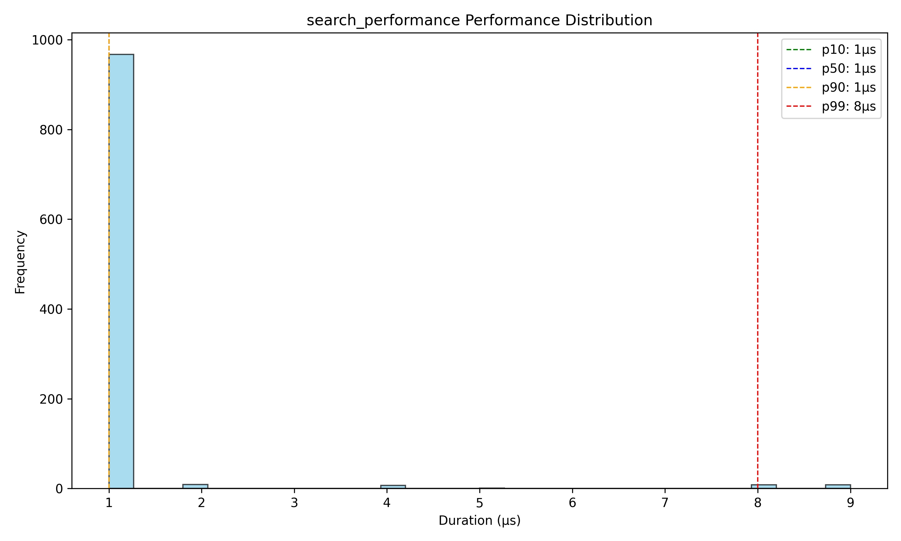

### Delete Operation
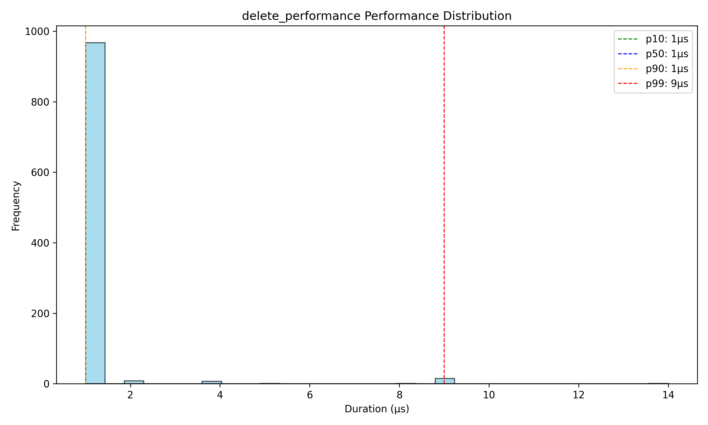

### Text Search Operation
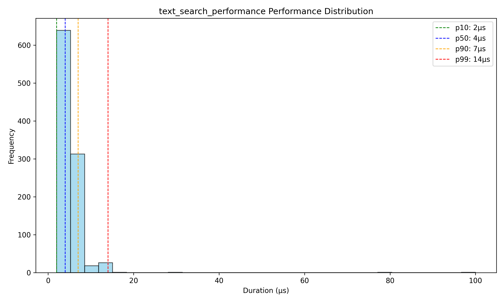

## Integration Performance Distributions

### Integration Index
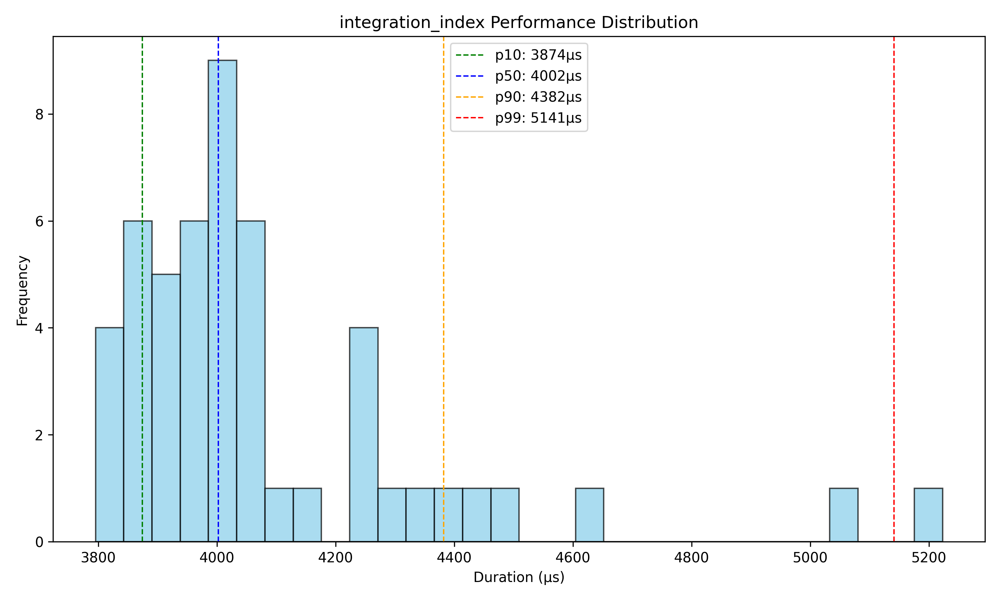

### Integration Search
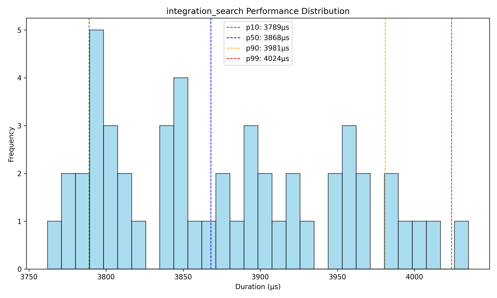

### Integration Delete
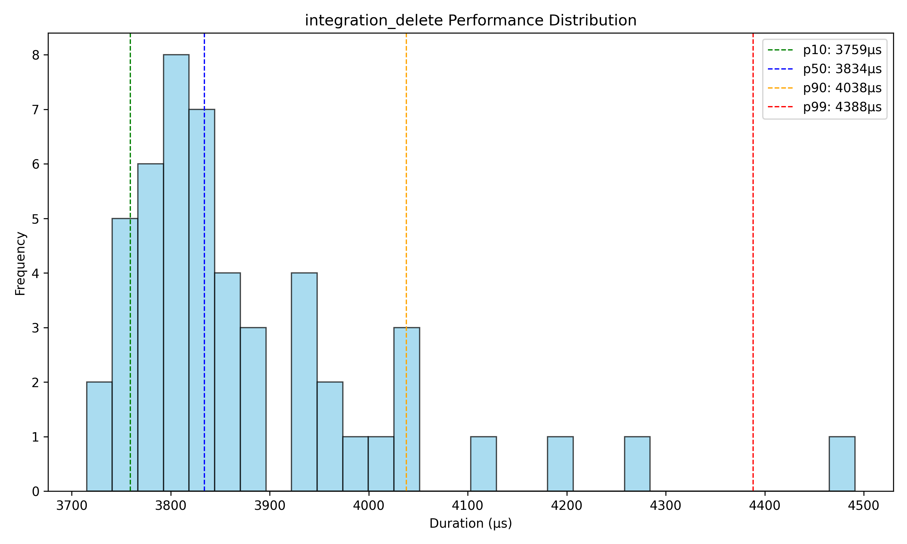

## Performance Comparisons

### Insert Comparison
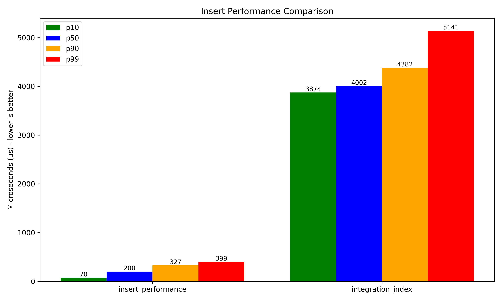

### Search Comparison
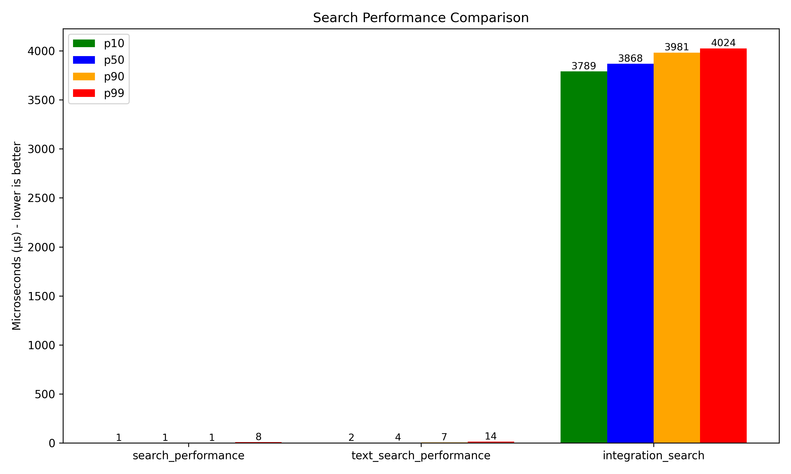

### Delete Comparison
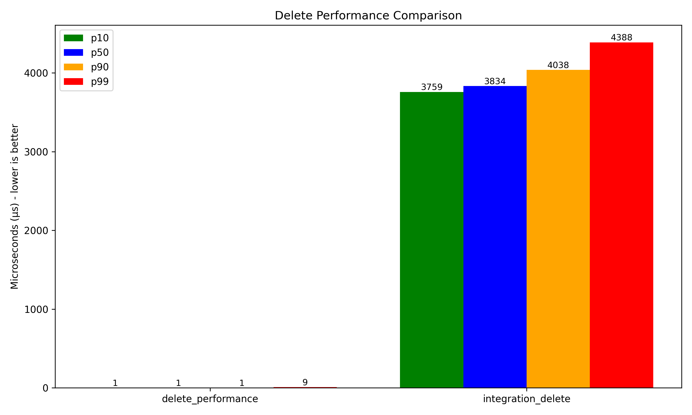

## Hot vs Cold Performance

### Hot vs Cold Search Performance
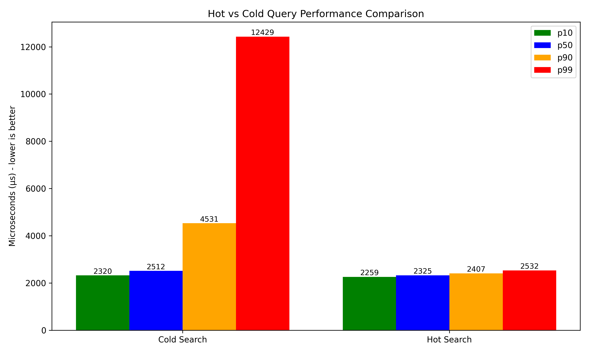

This comparison shows the performance difference between:
- **Cold Search**: Queries performed immediately after server startup with existing data
- **Hot Search**: Queries performed after the server has been running and processing requests

A significant performance improvement is typically observed in the hot state due to:
- In-memory caching of data structures
- JIT compilation optimizations
- Operating system file caching
- Preloaded and optimized data structures

### Server Reload Performance
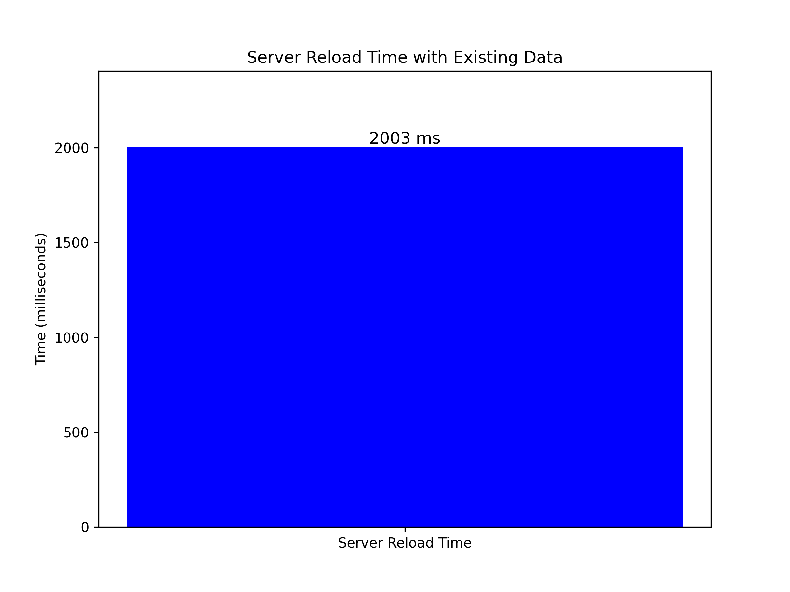

This chart shows the time taken to start the server with existing data. This metric is important for understanding:
- Cold start latency with production data volumes
- Recovery time after planned or unplanned restarts
- Impact of data size on startup performance

## Testing Methodology

The hot/cold loading tests measure:

1. **Cold Start Time**: Time to start the server with existing data
2. **Cold Query Performance**: Search latency immediately after server startup
3. **Hot Query Performance**: Search latency after server has processed many queries
4. **Server Reload Time**: Time to restart the server with existing data

Test parameters:
- 100 documents indexed before testing
- 50 search operations for each test phase
- Multiple search terms to exercise different aspects of the index
- Server restart between cold and hot phases